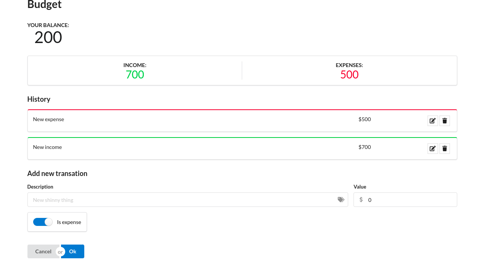

# React Redux & Redux Saga

This proyect show a simple application using React + Redux + Redux Saga

## What I learned

- React-Saga
- State management
- React-redux
- React Hooks
- React Semantic UI

### Built with

- React JS 18
- Vite
- Semantic UI

## Installation

This React project has been created using [Vite](https://vitejs.dev/guide/).

Step 1:

You need to install yarn. Yarn is a package and library manager.

Step 2:

```bash
git clone https://github.com/bryanAguilar001/react-redux-saga-app.git
cd budget
```

Step 3:

Run this command to install libs

```bash
yarn
```

Step 4:

Run the app

```bash
yarn run start:all
```

## Author

- Website - [bryanaguilar](https://www.bryan-aguilar.com/)
- Medium - [bryanaguilar6174](https://bryanaguilar6174.medium.com/)
- LinkeIn - [bryanaguilar6174](https://www.linkedin.com/in/bryanaguilar6174)

## Budget App


